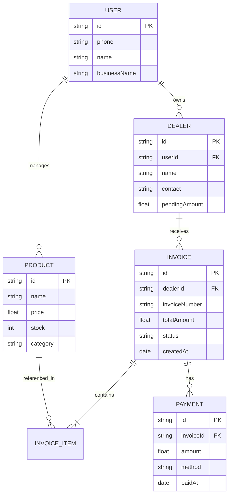

# ER Diagram | Database Relationships

```mermaid
erDiagram
    USER ||--o{ DEALER : owns
    USER ||--o{ PRODUCT : manages
    DEALER ||--o{ INVOICE : receives
    INVOICE ||--|{ INVOICE_ITEM : contains
    PRODUCT ||--o{ INVOICE_ITEM : referenced_in
    INVOICE ||--o{ PAYMENT : has
    
    USER {
        string id PK
        string phone
        string name
        string businessName
    }
    
    DEALER {
        string id PK
        string userId FK
        string name
        string contact
        float pendingAmount
    }
    
    INVOICE {
        string id PK
        string dealerId FK
        string invoiceNumber
        float totalAmount
        string status
        date createdAt
    }
    
    PRODUCT {
        string id PK
        string name
        float price
        int stock
        string category
    }
    
    PAYMENT {
        string id PK
        string invoiceId FK
        float amount
        string method
        date paidAt
    }
```
