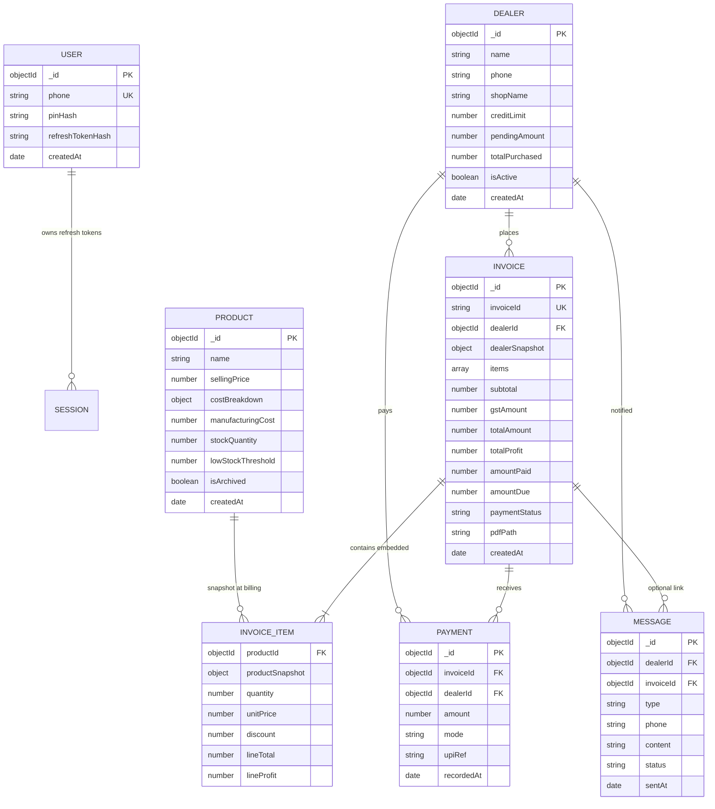

# ER Diagram — MongoDB Collections

**Relationships**

- One **Dealer** has many **Invoices** and many **Payments**.
- **Invoice** embeds **InvoiceItem** documents (product snapshot + line economics).
- **Payment** references both **Invoice** and **Dealer** for fast ledger queries.
- **Message** optionally references **Invoice** for template context.
