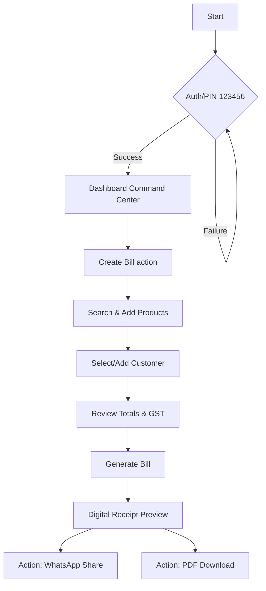
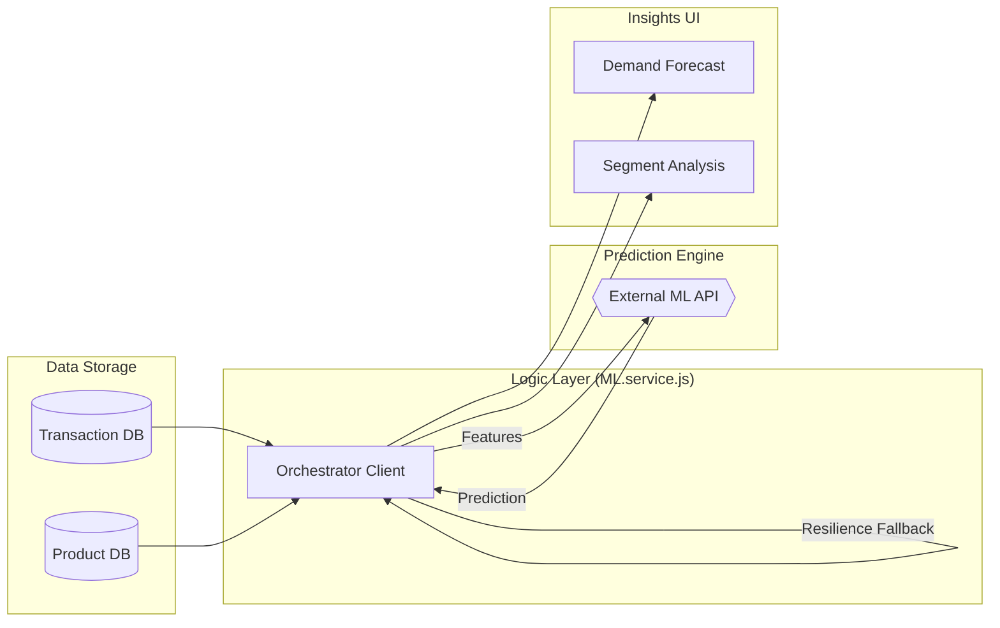

# PAKKABILL | Industrial Billing Engine

**Carbon Dark Edition: Black, White, and Orange.**

PakkaBill is a high-performance, industrial-grade mobile billing and inventory management application designed for modern wholesalers and retailers. Built with extreme contrast and efficiency, it provides a "Command Center" experience for managing sales, revenue, and customer accounts.

---

## Design System: Carbon Dark
PakkaBill uses a bespoke **Carbon Dark** aesthetic optimized for high-impact visibility and efficiency:
- **Primary Accent**: Electric Orange (`#FF6B00`) for high-reach actions and trend indicators.
- **Background**: Pure Carbon Black (`#000000`) for battery conservation and contrast.
- **Surface**: Deep Slate (`#121212`) for card depth and data separation.
- **Typography**: Heavy, industrial-style bold weights and uppercase headers.

---

##  Workflow Architecture

### 1. General Application Workflow
The core "Money Path" of the application, from authentication to sharing the digital receipt.



### 2. AI / ML Implementation Workflow
A specialized workflow illustrating how the predictive intelligence layer orchestrates demand forecasting and segmentation.



---

## Key Feature Matrix
- **Command Center (Dashboard)**: Real-time MTD revenue tracking with dynamic growth indicators.
- **Billing Engine**: Industrial-strength bill generation with GST compliance and SKU management.
- **Growth Analytics**: Precision trend tracking and product performance SKU meters.
- **Digital Receipt**: High-contrast digital receipts with WhatsApp sharing and PDF generation.
- **Secure Console**: Professional PIN-based login (Pattern: Carbon Industrial).

---

## Access Credentials
> [!IMPORTANT]
> **Default Admin PIN**: **`123456`**

---

## Technology Stack
- **Mobile Hardware**: React Native (via Expo), Expo Router.
- **Backend Architecture**: Node.js, Express.js.
- **Persistence Layer**: MongoDB (Mongoose).
- **Communication**: Axios, WhatsApp API integration.
- **UI/UX Framework**: Reanimated, Skia, Victory Native.

---

## Deployment Instructions

### 1. Backend Persistence Server (Port 5001)
```bash
cd backend
npm install
npm run dev
```

### 2. Mobile Client (Carbon Studio)
```bash
cd mobile
npm install
npx expo start
```

---


