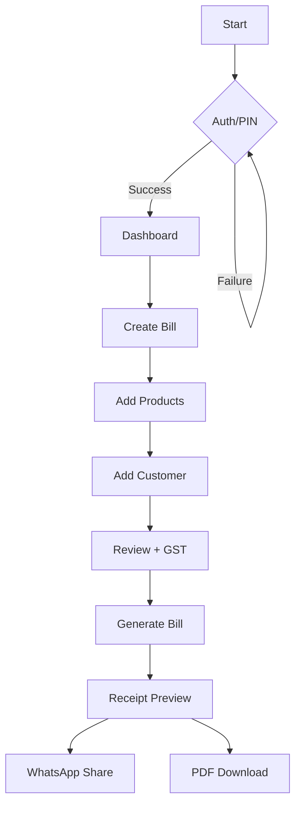
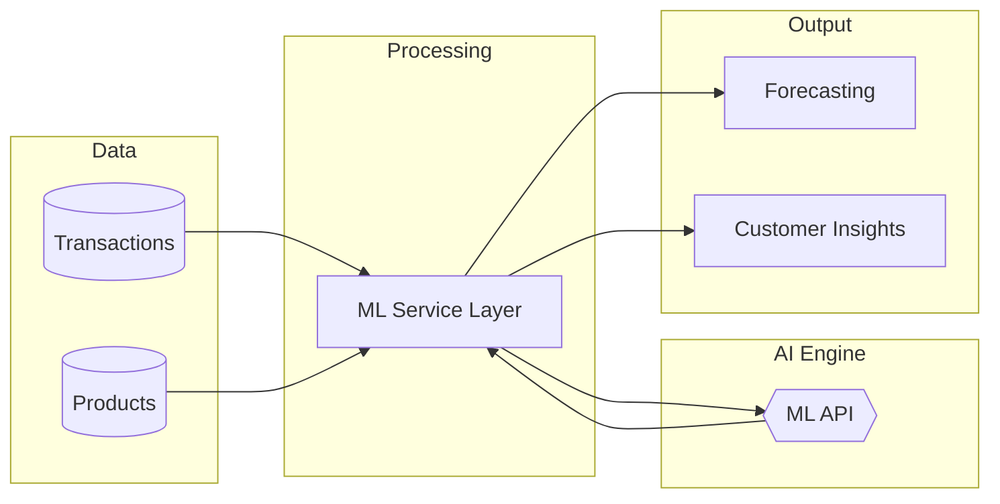

# PakkaBill | AI-Powered Billing Software

PakkaBill is a modern billing and inventory management system designed for real businesses. It combines fast billing workflows with AI-driven insights to help users not just record transactions, but make smarter financial decisions.

---

## What Makes It Different

Traditional billing software only tracks data.  
PakkaBill goes a step further by adding an intelligent layer on top of it.

- Fast invoice generation with GST support  
- Real-time business insights  
- AI-powered analytics and predictions  
- Mobile-first, clean, high-contrast UI  

---

## AI / ML Integrations

PakkaBill includes a built-in intelligence layer that turns raw billing data into actionable insights:

### Smart Demand Forecasting
Predicts which products will sell more based on past transactions.

### Customer Segmentation
Automatically groups customers based on buying behavior.

### Revenue Insights
Provides insights such as:
- Top-performing products  
- High-value customers  
- Revenue trends  

### Future Scope
- Cash flow prediction  
- Anomaly detection (fraud or unusual billing patterns)  
- AI assistant for querying business data  

---

## Core Features

### Billing System
- GST-compliant invoice generation  
- Product and SKU management  
- Customer management  

### Dashboard
- Monthly revenue tracking  
- Growth indicators  
- Business performance overview  

### Digital Receipts
- PDF generation  
- WhatsApp sharing  

### Security
- PIN-based authentication system  

---

## Architecture Overview

### General Application Workflow

### AI/ML INTEGRATION

