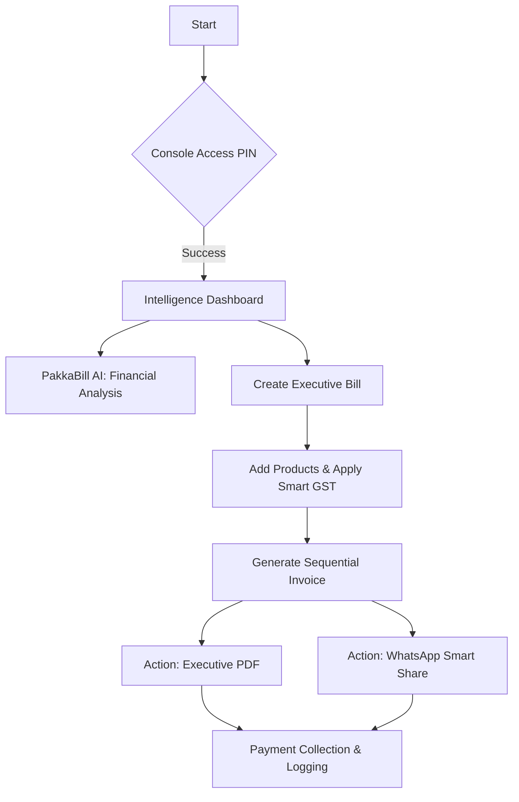

# PakkaBill | Executive Invoicing & Intelligence

**The Ultimate Billing System for Elite Wholesalers.**

PakkaBill is a high-performance, industrial-grade mobile billing and inventory management suite. Re-engineered for speed, brand authority, and predictive intelligence, it transforms standard invoicing into a premium "Executive Elite" experience.

---

## The Executive Aesthetic
PakkaBill uses a bespoke obsidian-themed design system optimized for high-impact visibility:
- **Primary Accent**: Electric Orange (`#FF6B00`) for high-reach actions and trend indicators.
- **Background**: Pure Carbon Black (`#000000`) for battery conservation and peak contrast.
- **Surface**: Obsidian Slate (`#080808`) for depth and professional data separation.
- **Documents**: Executive Elite PDF design with charcoal headers and high-contrast financial grids.

---

## Key Integrated Systems

### 1. PakkaBill AI Assistant (Intelligence Layer)
A deep-integrated LLM engine that understands your business data in natural language.
- **Revenue Queries**: Ask "What is my total sales for this week?" and get instant answers.
- **Due Tracking**: Ask "Who owes me the most money?" to identify high-risk accounts.
- **Smart GST**: Automatic tax suggestions based on product categories and SKU history.

### 2. High-Fidelity Document Engine
Professional document generation starting from sequential bill numbering (#00001).
- **Executive PDF**: Corporate-grade design with structured client data and payment summaries.
- **Smart WhatsApp Share**: Dual-action sharing that sends the PDF file and automatically copies professional captions to the clipboard for instant "Paste & Send" workflows.

### 3. Financial Lifecycle Management
Full-cycle payment tracking from partial deposits to fully cleared invoices.
- **Manage Payments**: Log, review, and delete incorrect payments with automatic balance re-calculation.
- **Stock Guard**: Real-time inventory tracking with low-stock alerts and advanced SKU management.

---

## Workflow Architecture

### Core Financial Path
The seamless journey from lead to payment.



---

## Technology Architecture
- **Terminal Framework**: React Native (Expo SDK 54), Expo Router.
- **Core Intelligence**: Node.js, Express.js with custom RAG (Retrieval) AI logic.
- **Data Persistence**: MongoDB (Mongoose Architecture).
- **Document Rendering**: PDFKit (Industrial Configuration).
- **UI Framework**: Reanimated 4, Lucide Icons, Victory Native.

---

## Quick Setup

### 1. Backend Core (Port 5001)
```bash
cd backend
npm install
npm run dev
```

### 2. Mobile Console
```bash
cd mobile
npm install
npx expo start
```

---
