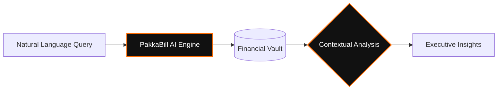

# PakkaBill | Executive Invoicing & Business Intelligence

<p align="center">
  
  
  
</p>

**PakkaBill** is a high-performance, industrial-grade mobile suite designed for elite wholesalers and manufacturers. Re-engineered for speed, brand authority, and predictive intelligence, it transforms standard invoicing into a premium **"Executive Elite"** experience.

---

## Core Workflow Architecture

The seamless journey from business intelligence to financial clearance, optimized for maximum efficiency.

### Executive Sales Cycle (Horizontal Flow)


### AI Intelligence Layer



---

## Premium Feature Ecosystem

### The Executive Aesthetic
PakkaBill uses a bespoke obsidian-themed design system optimized for high-impact visibility:
*   **Primary Accent**: Electric Orange (`#FF6B00`) for high-reach actions and trend indicators.
*   **Surfaces**: Obsidian Slate (`#080808`) and Pure Carbon (`#000000`) for peak data contrast.
*   **Typography**: Industrial Sans-Serif for maximum readability in high-pressure environments.

### High-Fidelity Document Engine
Professional document generation starting from sequential bill numbering.
*   **Elite PDF Design**: Corporate-grade layouts with structured client data and dynamic financial grids.
*   **Smart WhatsApp Share**: Dual-action sharing that sends the PDF and auto-copies professional captions to the clipboard for "Paste & Send" efficiency.

### Predictive Intelligence & Dashboards
*   **Real-time Revenue Growth**: Track MTD performance with visual delta indicators.
*   **Pending Amount Heatmaps**: Instantly identify top-debtor accounts and high-risk receivables.
*   **Sales Velocity Tracking**: Understand which SKUs are driving your business growth.

---

## Technical Infrastructure

| Layer | Technology |
| :--- | :--- |
| **Mobile Terminal** | React Native (Expo SDK 54) + Expo Router |
| **Backend Core** | Node.js (Express.js) |
| **Intelligence** | Custom RAG (Retrieval-Augmented Generation) Architecture |
| **Data Persistence** | MongoDB (Mongoose Schema Design) |
| **Document Engine** | PDFKit (Industrial-Grade Configuration) |
| **Styling** | Reanimated 4 + Custom Obsidian Design Tokens |

---

## Quick Deployment

### 1. Backend Integration
```bash
# Navigate to core
cd backend

# Initialize dependencies
npm install

# Launch production-ready dev server
npm run dev
```

### 2. Mobile Console
```bash
# Navigate to application
cd mobile

# Initialize dependencies
npm install

# Boot high-performance terminal
npx expo start
```

---

<p align="center">
  <b>PakkaBill Executive Edition</b><br/>
  <i>Engineered for the Modern Industrialist.</i>
</p>
