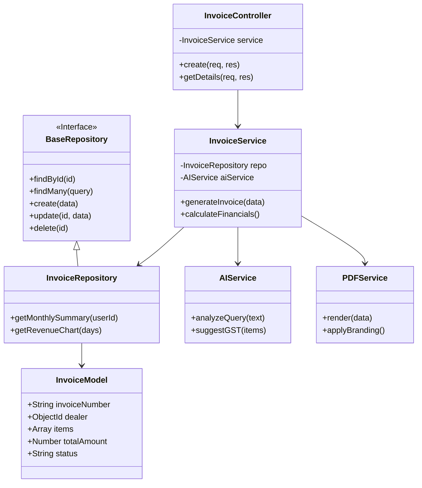

# Class Diagram | Backend System Architecture

```mermaid
classDiagram
    class BaseRepository {
        <<Interface>>
        +findById(id)
        +findMany(query)
        +create(data)
        +update(id, data)
        +delete(id)
    }

    class InvoiceRepository {
        +getMonthlySummary(userId)
        +getRevenueChart(days)
    }

    class InvoiceService {
        -InvoiceRepository repo
        -AIService aiService
        +generateInvoice(data)
        +calculateFinancials()
    }

    class InvoiceController {
        -InvoiceService service
        +create(req, res)
        +getDetails(req, res)
    }

    class AIService {
        +analyzeQuery(text)
        +suggestGST(items)
    }

    class PDFService {
        +render(data)
        +applyBranding()
    }

    BaseRepository <|-- InvoiceRepository
    InvoiceController --> InvoiceService
    InvoiceService --> InvoiceRepository
    InvoiceService --> AIService
    InvoiceService --> PDFService
    
    class InvoiceModel {
        +String invoiceNumber
        +ObjectId dealer
        +Array items
        +Number totalAmount
        +String status
    }
    
    InvoiceRepository --> InvoiceModel
```
