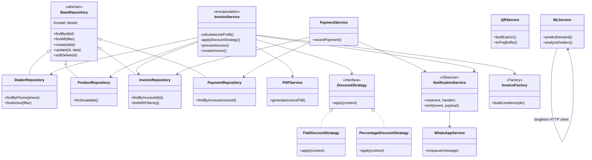

# Class Diagram — Layers & Design Patterns

**Patterns (summary)**

| Pattern | Where |
|---------|--------|
| Repository | All `*Repository` classes — DB access only |
| Factory | `InvoiceFactory` — builds line items / DTOs |
| Observer | `NotificationService` — payment / invoice events → WhatsApp |
| Strategy | `DiscountStrategy` implementations — swappable discounts |
| Singleton | DB connection, Redis client, `NotificationService` instance |
