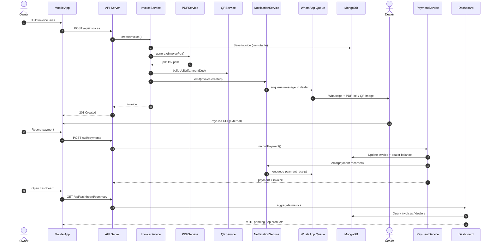

# Sequence Diagram — End-to-End Invoice Flow

Primary flow: owner creates invoice → PDF → UPI QR → WhatsApp → payment → balances → dashboard.

```mermaid
sequenceDiagram
  autonumber
  actor Owner
  participant App as Mobile App
  participant API as API Server
  participant InvSvc as InvoiceService
  participant PDF as PDFService
  participant QR as QRService
  participant Notif as NotificationService
  participant WA as WhatsApp Queue
  participant DB as MongoDB
  actor Dealer
  participant PaySvc as PaymentService
  participant Dash as Dashboard

  Owner->>App: Build invoice lines
  App->>API: POST /api/invoices
  API->>InvSvc: createInvoice()
  InvSvc->>DB: Save invoice (immutable)
  InvSvc->>PDF: generateInvoicePdf()
  PDF-->>InvSvc: pdfUrl / path
  InvSvc->>QR: buildUpiUri(amountDue)
  InvSvc->>Notif: emit(invoice.created)
  Notif->>WA: enqueue message to dealer
  WA->>Dealer: WhatsApp + PDF link / QR image
  InvSvc-->>API: invoice
  API-->>App: 201 Created

  Dealer->>App: Pays via UPI (external)
  Owner->>App: Record payment
  App->>API: POST /api/payments
  API->>PaySvc: recordPayment()
  PaySvc->>DB: Update invoice + dealer balance
  PaySvc->>Notif: emit(payment.recorded)
  Notif->>WA: enqueue payment receipt
  PaySvc-->>API: payment + invoice
  Owner->>App: Open dashboard
  App->>API: GET /api/dashboard/summary
  API->>Dash: aggregate metrics
  Dash->>DB: Query invoices / dealers
  Dash-->>App: MTD, pending, top products
```
