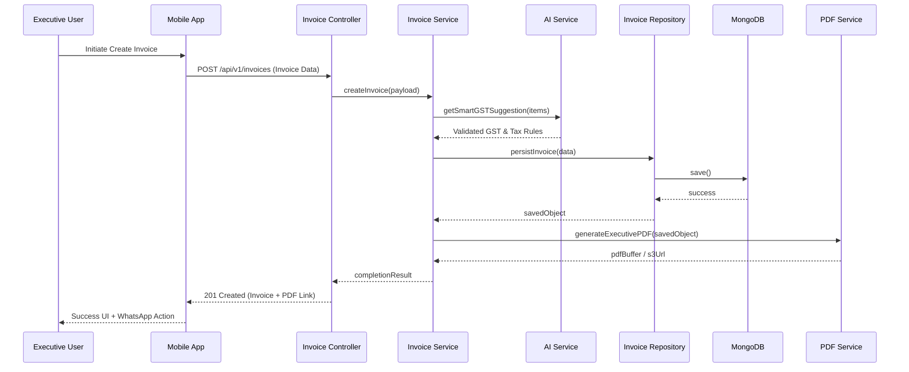

# Sequence Diagram | Main Invoicing Flow

```mermaid
sequenceDiagram
    participant U as Executive User
    participant M as Mobile App
    participant C as Invoice Controller
    participant S as Invoice Service
    participant AI as AI Service
    participant R as Invoice Repository
    participant DB as MongoDB
    participant PDF as PDF Service

    U->>M: Initiate Create Invoice
    M->>C: POST /api/v1/invoices (Invoice Data)
    C->>S: createInvoice(payload)
    
    S->>AI: getSmartGSTSuggestion(items)
    AI-->>S: Validated GST & Tax Rules
    
    S->>R: persistInvoice(data)
    R->>DB: save()
    DB-->>R: success
    R-->>S: savedObject
    
    S->>PDF: generateExecutivePDF(savedObject)
    PDF-->>S: pdfBuffer / s3Url
    
    S-->>C: completionResult
    C-->>M: 201 Created (Invoice + PDF Link)
    M-->>U: Success UI + WhatsApp Action
```
