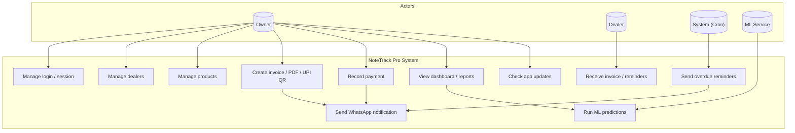

# Use Case Diagram — NoteTrack Pro

```mermaid
flowchart TB
  subgraph Actors
    Owner[("Owner")]
    Dealer[("Dealer")]
    Cron[("System (Cron)")]
    ML[("ML Service")]
  end

  subgraph System["NoteTrack Pro System"]
    UC1[Manage login / session]
    UC2[Manage dealers]
    UC3[Manage products]
    UC4[Create invoice / PDF / UPI QR]
    UC5[Send WhatsApp notification]
    UC6[Record payment]
    UC7[View dashboard / reports]
    UC8[Receive invoice / reminders]
    UC9[Send overdue reminders]
    UC10[Run ML predictions]
    UC11[Check app updates]
  end

  Owner --> UC1
  Owner --> UC2
  Owner --> UC3
  Owner --> UC4
  Owner --> UC6
  Owner --> UC7
  Owner --> UC11

  Dealer --> UC8

  Cron --> UC9

  ML --> UC10

  UC4 --> UC5
  UC6 --> UC5
  UC9 --> UC5
  UC7 --> UC10
```
